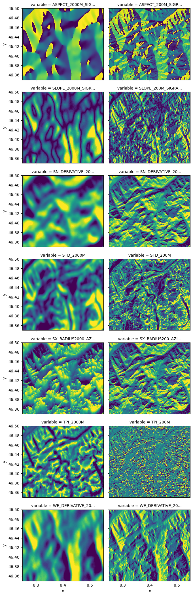

# topo-descriptors

A python library to compute DEM-based topographical descriptors.

## Usage

Let's install `topo-descriptors` with few additional packages that will help us
to run a simple example (remember to use a virtual environment):


```python
%pip install topo-descriptors elevation rioxarray matplotlib --quiet
```

    Note: you may need to restart the kernel to use updated packages.


The [elevation](https://github.com/bopen/elevation) package is an python library that
provides an easy access to global elevation data. Here we are going to clip the SRTM 30m
DEM around the Basodino region in southern Switzerland, around 46.4N 8.5E:


```python
!eio clip -o Basodino-30m-DEM.tif --bounds 8.2 46.30 8.6 46.55
```

    make: Nothing to be done for `download'.
    make: Nothing to be done for `all'.
    cp SRTM1.vrt SRTM1.c19d3178b3544e9b9554bf942f89bbdc.vrt
    gdal_translate -q -co TILED=YES -co COMPRESS=DEFLATE -co ZLEVEL=9 -co PREDICTOR=2 -projwin 8.2 46.55 8.6 46.3 SRTM1.c19d3178b3544e9b9554bf942f89bbdc.vrt /Users/daniele/src/topo-descriptors/Basodino-30m-DEM.tif
    rm -f SRTM1.c19d3178b3544e9b9554bf942f89bbdc.vrt


```python
import logging

logger = logging.getLogger()
handler = logging.StreamHandler()
formatter = logging.Formatter("%(asctime)s %(name)-12s %(levelname)-8s %(message)s")
handler.setFormatter(formatter)
logger.addHandler(handler)
logger.setLevel(logging.INFO)
```

Now in python we can use the xarray interface to rasterio to easily import the
`Basodino-30m-DEM.tif` file generated above:


```python
import xarray as xr

dem = xr.open_rasterio("Basodino-30m-DEM.tif")
dem = dem.isel(band=0, drop=True)
dem.plot(robust=True)
```

    /var/folders/v1/d7jjg8d52fl77y27qbv75bw80000gp/T/ipykernel_8443/102662558.py:3: DeprecationWarning: open_rasterio is Deprecated in favor of rioxarray. For information about transitioning, see: https://corteva.github.io/rioxarray/stable/getting_started/getting_started.html
      dem = xr.open_rasterio("Basodino-30m-DEM.tif")


    <matplotlib.collections.QuadMesh at 0x150070250>


    

    


```python
from topo_descriptors import topo, helpers

scale_meters = 500
scale_pixel, __ = helpers.scale_to_pixel(scale_meters, dem)
topo.tpi(dem, scale_pixel).plot(vmin=-100, vmax=100, cmap="bwr")
```

    2023-01-09 18:56:33,286 yaconfigobject INFO     Loading /Users/daniele/src/topo-descriptors/topo_descriptors/config/topo_descriptors.conf.
    2023-01-09 18:56:33,286 yaconfigobject INFO     Loading configuration file: /Users/daniele/src/topo-descriptors/topo_descriptors/config/topo_descriptors.conf
    2023-01-09 18:56:33,801 topo_descriptors.helpers INFO     Computed in 0:00:00 (HH:mm:ss)


    <matplotlib.collections.QuadMesh at 0x28fd5f250>


    

    


The Sx is used to describe the horizon in a given direction and spatial scale.
In the example below we compute the Sx for a 0° azimuth (i.e., looking North)
and a radius of 500 meters.


```python
sx_500m = topo.sx(dem, azimuth=0, radius=500)
xr.DataArray(sx_500m, coords=dem.coords).plot.imshow()
```

    OMP: Info #276: omp_set_nested routine deprecated, please use omp_set_max_active_levels instead.
    2023-01-09 18:56:37,984 topo_descriptors.helpers INFO     Computed in 0:00:03 (HH:mm:ss)


    <matplotlib.image.AxesImage at 0x2b2eff550>


    

    


Other topographical descriptors are available, such as slope, aspect, derivatives,
and more.


```python
from pathlib import Path

output_dir = Path("out/")
output_dir.mkdir(exist_ok=True)

scales_meters = [200, 2000]
domain = {"x": slice(8.25, 8.55), "y": slice(46.50, 46.35)}

topo.compute_gradient(dem, scales_meters, sig_ratios=1, crop=domain, outdir=output_dir)
topo.compute_std(dem, scales_meters, crop=domain, outdir=output_dir)
topo.compute_tpi(dem, scales_meters, crop=domain, outdir=output_dir)
topo.compute_sx(dem, azimuth=0, radius=scales_meters[0], crop=domain, outdir=output_dir)
topo.compute_sx(dem, azimuth=0, radius=scales_meters[1], crop=domain, outdir=output_dir)

ds = xr.open_mfdataset(str(output_dir / "topo_*.nc"))
ds
```

    2023-01-09 18:56:38,124 topo_descriptors.topo INFO     ***Starting gradients computation for scales [200, 2000] meters***
    2023-01-09 18:56:38,257 topo_descriptors.topo INFO     Computing scale 200 meters with sigma ratio 1 ...
    2023-01-09 18:56:38,302 topo_descriptors.helpers INFO     Computed in 0:00:00 (HH:mm:ss)
    2023-01-09 18:56:38,340 topo_descriptors.helpers INFO     saved: out/topo_WE_DERIVATIVE_200M_SIGRATIO1.nc
    2023-01-09 18:56:38,344 topo_descriptors.helpers INFO     saved: out/topo_SN_DERIVATIVE_200M_SIGRATIO1.nc
    2023-01-09 18:56:38,348 topo_descriptors.helpers INFO     saved: out/topo_SLOPE_200M_SIGRATIO1.nc
    2023-01-09 18:56:38,351 topo_descriptors.helpers INFO     saved: out/topo_ASPECT_200M_SIGRATIO1.nc
    2023-01-09 18:56:38,352 topo_descriptors.topo INFO     Computing scale 2000 meters with sigma ratio 1 ...
    2023-01-09 18:56:38,510 topo_descriptors.helpers INFO     Computed in 0:00:00 (HH:mm:ss)
    2023-01-09 18:56:38,515 topo_descriptors.helpers INFO     saved: out/topo_WE_DERIVATIVE_2000M_SIGRATIO1.nc
    2023-01-09 18:56:38,518 topo_descriptors.helpers INFO     saved: out/topo_SN_DERIVATIVE_2000M_SIGRATIO1.nc
    2023-01-09 18:56:38,522 topo_descriptors.helpers INFO     saved: out/topo_SLOPE_2000M_SIGRATIO1.nc
    2023-01-09 18:56:38,526 topo_descriptors.helpers INFO     saved: out/topo_ASPECT_2000M_SIGRATIO1.nc
    2023-01-09 18:56:38,527 topo_descriptors.topo INFO     ***Starting STD computation for scales [200, 2000] meters***
    2023-01-09 18:56:38,662 topo_descriptors.topo INFO     Computing scale 200 meters with smoothing factor None ...
    2023-01-09 18:56:38,716 topo_descriptors.helpers INFO     Computed in 0:00:00 (HH:mm:ss)
    2023-01-09 18:56:38,721 topo_descriptors.helpers INFO     saved: out/topo_STD_200M.nc
    2023-01-09 18:56:38,721 topo_descriptors.topo INFO     Computing scale 2000 meters with smoothing factor None ...
    2023-01-09 18:56:38,777 topo_descriptors.helpers INFO     Computed in 0:00:00 (HH:mm:ss)
    2023-01-09 18:56:38,781 topo_descriptors.helpers INFO     saved: out/topo_STD_2000M.nc
    2023-01-09 18:56:38,782 topo_descriptors.topo INFO     ***Starting TPI computation for scales [200, 2000] meters***
    2023-01-09 18:56:38,919 topo_descriptors.topo INFO     Computing scale 200 meters with smoothing factor None ...
    2023-01-09 18:56:38,944 topo_descriptors.helpers INFO     Computed in 0:00:00 (HH:mm:ss)
    2023-01-09 18:56:38,949 topo_descriptors.helpers INFO     saved: out/topo_TPI_200M.nc
    2023-01-09 18:56:38,949 topo_descriptors.topo INFO     Computing scale 2000 meters with smoothing factor None ...
    2023-01-09 18:56:38,974 topo_descriptors.helpers INFO     Computed in 0:00:00 (HH:mm:ss)
    2023-01-09 18:56:38,978 topo_descriptors.helpers INFO     saved: out/topo_TPI_2000M.nc
    2023-01-09 18:56:38,979 topo_descriptors.topo INFO     ***Starting Sx computation for azimuth 0 meters and radius 200***
    2023-01-09 18:56:41,214 topo_descriptors.helpers INFO     Computed in 0:00:02 (HH:mm:ss)
    2023-01-09 18:56:41,218 topo_descriptors.helpers INFO     saved: out/topo_SX_RADIUS200_AZIMUTH0.nc
    2023-01-09 18:56:41,219 topo_descriptors.topo INFO     ***Starting Sx computation for azimuth 0 meters and radius 2000***
    2023-01-09 18:56:43,065 topo_descriptors.helpers INFO     Computed in 0:00:01 (HH:mm:ss)
    2023-01-09 18:56:43,069 topo_descriptors.helpers INFO     saved: out/topo_SX_RADIUS2000_AZIMUTH0.nc


<div><svg style="position: absolute; width: 0; height: 0; overflow: hidden">
<defs>
<symbol id="icon-database" viewBox="0 0 32 32">
<path d="M16 0c-8.837 0-16 2.239-16 5v4c0 2.761 7.163 5 16 5s16-2.239 16-5v-4c0-2.761-7.163-5-16-5z"></path>
<path d="M16 17c-8.837 0-16-2.239-16-5v6c0 2.761 7.163 5 16 5s16-2.239 16-5v-6c0 2.761-7.163 5-16 5z"></path>
<path d="M16 26c-8.837 0-16-2.239-16-5v6c0 2.761 7.163 5 16 5s16-2.239 16-5v-6c0 2.761-7.163 5-16 5z"></path>
</symbol>
<symbol id="icon-file-text2" viewBox="0 0 32 32">
<path d="M28.681 7.159c-0.694-0.947-1.662-2.053-2.724-3.116s-2.169-2.030-3.116-2.724c-1.612-1.182-2.393-1.319-2.841-1.319h-15.5c-1.378 0-2.5 1.121-2.5 2.5v27c0 1.378 1.122 2.5 2.5 2.5h23c1.378 0 2.5-1.122 2.5-2.5v-19.5c0-0.448-0.137-1.23-1.319-2.841zM24.543 5.457c0.959 0.959 1.712 1.825 2.268 2.543h-4.811v-4.811c0.718 0.556 1.584 1.309 2.543 2.268zM28 29.5c0 0.271-0.229 0.5-0.5 0.5h-23c-0.271 0-0.5-0.229-0.5-0.5v-27c0-0.271 0.229-0.5 0.5-0.5 0 0 15.499-0 15.5 0v7c0 0.552 0.448 1 1 1h7v19.5z"></path>
<path d="M23 26h-14c-0.552 0-1-0.448-1-1s0.448-1 1-1h14c0.552 0 1 0.448 1 1s-0.448 1-1 1z"></path>
<path d="M23 22h-14c-0.552 0-1-0.448-1-1s0.448-1 1-1h14c0.552 0 1 0.448 1 1s-0.448 1-1 1z"></path>
<path d="M23 18h-14c-0.552 0-1-0.448-1-1s0.448-1 1-1h14c0.552 0 1 0.448 1 1s-0.448 1-1 1z"></path>
</symbol>
</defs>
</svg>
<style>/* CSS stylesheet for displaying xarray objects in jupyterlab.
 *
 */

:root {
  --xr-font-color0: var(--jp-content-font-color0, rgba(0, 0, 0, 1));
  --xr-font-color2: var(--jp-content-font-color2, rgba(0, 0, 0, 0.54));
  --xr-font-color3: var(--jp-content-font-color3, rgba(0, 0, 0, 0.38));
  --xr-border-color: var(--jp-border-color2, #e0e0e0);
  --xr-disabled-color: var(--jp-layout-color3, #bdbdbd);
  --xr-background-color: var(--jp-layout-color0, white);
  --xr-background-color-row-even: var(--jp-layout-color1, white);
  --xr-background-color-row-odd: var(--jp-layout-color2, #eeeeee);
}

html[theme=dark],
body[data-theme=dark],
body.vscode-dark {
  --xr-font-color0: rgba(255, 255, 255, 1);
  --xr-font-color2: rgba(255, 255, 255, 0.54);
  --xr-font-color3: rgba(255, 255, 255, 0.38);
  --xr-border-color: #1F1F1F;
  --xr-disabled-color: #515151;
  --xr-background-color: #111111;
  --xr-background-color-row-even: #111111;
  --xr-background-color-row-odd: #313131;
}

.xr-wrap {
  display: block !important;
  min-width: 300px;
  max-width: 700px;
}

.xr-text-repr-fallback {
  /* fallback to plain text repr when CSS is not injected (untrusted notebook) */
  display: none;
}

.xr-header {
  padding-top: 6px;
  padding-bottom: 6px;
  margin-bottom: 4px;
  border-bottom: solid 1px var(--xr-border-color);
}

.xr-header > div,
.xr-header > ul {
  display: inline;
  margin-top: 0;
  margin-bottom: 0;
}

.xr-obj-type,
.xr-array-name {
  margin-left: 2px;
  margin-right: 10px;
}

.xr-obj-type {
  color: var(--xr-font-color2);
}

.xr-sections {
  padding-left: 0 !important;
  display: grid;
  grid-template-columns: 150px auto auto 1fr 20px 20px;
}

.xr-section-item {
  display: contents;
}

.xr-section-item input {
  display: none;
}

.xr-section-item input + label {
  color: var(--xr-disabled-color);
}

.xr-section-item input:enabled + label {
  cursor: pointer;
  color: var(--xr-font-color2);
}

.xr-section-item input:enabled + label:hover {
  color: var(--xr-font-color0);
}

.xr-section-summary {
  grid-column: 1;
  color: var(--xr-font-color2);
  font-weight: 500;
}

.xr-section-summary > span {
  display: inline-block;
  padding-left: 0.5em;
}

.xr-section-summary-in:disabled + label {
  color: var(--xr-font-color2);
}

.xr-section-summary-in + label:before {
  display: inline-block;
  content: '►';
  font-size: 11px;
  width: 15px;
  text-align: center;
}

.xr-section-summary-in:disabled + label:before {
  color: var(--xr-disabled-color);
}

.xr-section-summary-in:checked + label:before {
  content: '▼';
}

.xr-section-summary-in:checked + label > span {
  display: none;
}

.xr-section-summary,
.xr-section-inline-details {
  padding-top: 4px;
  padding-bottom: 4px;
}

.xr-section-inline-details {
  grid-column: 2 / -1;
}

.xr-section-details {
  display: none;
  grid-column: 1 / -1;
  margin-bottom: 5px;
}

.xr-section-summary-in:checked ~ .xr-section-details {
  display: contents;
}

.xr-array-wrap {
  grid-column: 1 / -1;
  display: grid;
  grid-template-columns: 20px auto;
}

.xr-array-wrap > label {
  grid-column: 1;
  vertical-align: top;
}

.xr-preview {
  color: var(--xr-font-color3);
}

.xr-array-preview,
.xr-array-data {
  padding: 0 5px !important;
  grid-column: 2;
}

.xr-array-data,
.xr-array-in:checked ~ .xr-array-preview {
  display: none;
}

.xr-array-in:checked ~ .xr-array-data,
.xr-array-preview {
  display: inline-block;
}

.xr-dim-list {
  display: inline-block !important;
  list-style: none;
  padding: 0 !important;
  margin: 0;
}

.xr-dim-list li {
  display: inline-block;
  padding: 0;
  margin: 0;
}

.xr-dim-list:before {
  content: '(';
}

.xr-dim-list:after {
  content: ')';
}

.xr-dim-list li:not(:last-child):after {
  content: ',';
  padding-right: 5px;
}

.xr-has-index {
  font-weight: bold;
}

.xr-var-list,
.xr-var-item {
  display: contents;
}

.xr-var-item > div,
.xr-var-item label,
.xr-var-item > .xr-var-name span {
  background-color: var(--xr-background-color-row-even);
  margin-bottom: 0;
}

.xr-var-item > .xr-var-name:hover span {
  padding-right: 5px;
}

.xr-var-list > li:nth-child(odd) > div,
.xr-var-list > li:nth-child(odd) > label,
.xr-var-list > li:nth-child(odd) > .xr-var-name span {
  background-color: var(--xr-background-color-row-odd);
}

.xr-var-name {
  grid-column: 1;
}

.xr-var-dims {
  grid-column: 2;
}

.xr-var-dtype {
  grid-column: 3;
  text-align: right;
  color: var(--xr-font-color2);
}

.xr-var-preview {
  grid-column: 4;
}

.xr-index-preview {
  grid-column: 2 / 5;
  color: var(--xr-font-color2);
}

.xr-var-name,
.xr-var-dims,
.xr-var-dtype,
.xr-preview,
.xr-attrs dt {
  white-space: nowrap;
  overflow: hidden;
  text-overflow: ellipsis;
  padding-right: 10px;
}

.xr-var-name:hover,
.xr-var-dims:hover,
.xr-var-dtype:hover,
.xr-attrs dt:hover {
  overflow: visible;
  width: auto;
  z-index: 1;
}

.xr-var-attrs,
.xr-var-data,
.xr-index-data {
  display: none;
  background-color: var(--xr-background-color) !important;
  padding-bottom: 5px !important;
}

.xr-var-attrs-in:checked ~ .xr-var-attrs,
.xr-var-data-in:checked ~ .xr-var-data,
.xr-index-data-in:checked ~ .xr-index-data {
  display: block;
}

.xr-var-data > table {
  float: right;
}

.xr-var-name span,
.xr-var-data,
.xr-index-name div,
.xr-index-data,
.xr-attrs {
  padding-left: 25px !important;
}

.xr-attrs,
.xr-var-attrs,
.xr-var-data,
.xr-index-data {
  grid-column: 1 / -1;
}

dl.xr-attrs {
  padding: 0;
  margin: 0;
  display: grid;
  grid-template-columns: 125px auto;
}

.xr-attrs dt,
.xr-attrs dd {
  padding: 0;
  margin: 0;
  float: left;
  padding-right: 10px;
  width: auto;
}

.xr-attrs dt {
  font-weight: normal;
  grid-column: 1;
}

.xr-attrs dt:hover span {
  display: inline-block;
  background: var(--xr-background-color);
  padding-right: 10px;
}

.xr-attrs dd {
  grid-column: 2;
  white-space: pre-wrap;
  word-break: break-all;
}

.xr-icon-database,
.xr-icon-file-text2,
.xr-no-icon {
  display: inline-block;
  vertical-align: middle;
  width: 1em;
  height: 1.5em !important;
  stroke-width: 0;
  stroke: currentColor;
  fill: currentColor;
}
</style><pre class='xr-text-repr-fallback'>&lt;xarray.Dataset&gt;
Dimensions:                        (y: 541, x: 1081)
Coordinates:
  * y                              (y) float64 46.5 46.5 46.5 ... 46.35 46.35
  * x                              (x) float64 8.25 8.25 8.251 ... 8.55 8.55
Data variables: (12/14)
    ASPECT_2000M_SIGRATIO1         (y, x) float64 dask.array&lt;chunksize=(541, 1081), meta=np.ndarray&gt;
    ASPECT_200M_SIGRATIO1          (y, x) float64 dask.array&lt;chunksize=(541, 1081), meta=np.ndarray&gt;
    SLOPE_2000M_SIGRATIO1          (y, x) float64 dask.array&lt;chunksize=(541, 1081), meta=np.ndarray&gt;
    SLOPE_200M_SIGRATIO1           (y, x) float64 dask.array&lt;chunksize=(541, 1081), meta=np.ndarray&gt;
    SN_DERIVATIVE_2000M_SIGRATIO1  (y, x) float64 dask.array&lt;chunksize=(541, 1081), meta=np.ndarray&gt;
    SN_DERIVATIVE_200M_SIGRATIO1   (y, x) float64 dask.array&lt;chunksize=(541, 1081), meta=np.ndarray&gt;
    ...                             ...
    SX_RADIUS2000_AZIMUTH0         (y, x) int16 dask.array&lt;chunksize=(541, 1081), meta=np.ndarray&gt;
    SX_RADIUS200_AZIMUTH0          (y, x) int16 dask.array&lt;chunksize=(541, 1081), meta=np.ndarray&gt;
    TPI_2000M                      (y, x) float32 dask.array&lt;chunksize=(541, 1081), meta=np.ndarray&gt;
    TPI_200M                       (y, x) float32 dask.array&lt;chunksize=(541, 1081), meta=np.ndarray&gt;
    WE_DERIVATIVE_2000M_SIGRATIO1  (y, x) float64 dask.array&lt;chunksize=(541, 1081), meta=np.ndarray&gt;
    WE_DERIVATIVE_200M_SIGRATIO1   (y, x) float64 dask.array&lt;chunksize=(541, 1081), meta=np.ndarray&gt;</pre><div class='xr-wrap' style='display:none'><div class='xr-header'><div class='xr-obj-type'>xarray.Dataset</div></div><ul class='xr-sections'><li class='xr-section-item'><input id='section-4b721130-c21d-4f9f-abf0-e0158e9eb303' class='xr-section-summary-in' type='checkbox' disabled ><label for='section-4b721130-c21d-4f9f-abf0-e0158e9eb303' class='xr-section-summary'  title='Expand/collapse section'>Dimensions:</label><div class='xr-section-inline-details'><ul class='xr-dim-list'><li><span class='xr-has-index'>y</span>: 541</li><li><span class='xr-has-index'>x</span>: 1081</li></ul></div><div class='xr-section-details'></div></li><li class='xr-section-item'><input id='section-c39f9bee-7072-4ccd-b25b-67114592fb19' class='xr-section-summary-in' type='checkbox'  checked><label for='section-c39f9bee-7072-4ccd-b25b-67114592fb19' class='xr-section-summary' >Coordinates: <span>(2)</span></label><div class='xr-section-inline-details'></div><div class='xr-section-details'><ul class='xr-var-list'><li class='xr-var-item'><div class='xr-var-name'><span class='xr-has-index'>y</span></div><div class='xr-var-dims'>(y)</div><div class='xr-var-dtype'>float64</div><div class='xr-var-preview xr-preview'>46.5 46.5 46.5 ... 46.35 46.35</div><input id='attrs-7741060f-e179-4ec9-9a4f-23d9c1e1239b' class='xr-var-attrs-in' type='checkbox' disabled><label for='attrs-7741060f-e179-4ec9-9a4f-23d9c1e1239b' title='Show/Hide attributes'><svg class='icon xr-icon-file-text2'><use xlink:href='#icon-file-text2'></use></svg></label><input id='data-8af5b18e-39a0-4d3c-bf92-76698ac7be7b' class='xr-var-data-in' type='checkbox'><label for='data-8af5b18e-39a0-4d3c-bf92-76698ac7be7b' title='Show/Hide data repr'><svg class='icon xr-icon-database'><use xlink:href='#icon-database'></use></svg></label><div class='xr-var-attrs'><dl class='xr-attrs'></dl></div><div class='xr-var-data'><pre>array([46.5     , 46.499722, 46.499444, ..., 46.350556, 46.350278, 46.35    ])</pre></div></li><li class='xr-var-item'><div class='xr-var-name'><span class='xr-has-index'>x</span></div><div class='xr-var-dims'>(x)</div><div class='xr-var-dtype'>float64</div><div class='xr-var-preview xr-preview'>8.25 8.25 8.251 ... 8.549 8.55 8.55</div><input id='attrs-eb1fb14c-acec-4045-b715-f11826b37af4' class='xr-var-attrs-in' type='checkbox' disabled><label for='attrs-eb1fb14c-acec-4045-b715-f11826b37af4' title='Show/Hide attributes'><svg class='icon xr-icon-file-text2'><use xlink:href='#icon-file-text2'></use></svg></label><input id='data-42b89181-2603-4f31-948b-b50333c6446e' class='xr-var-data-in' type='checkbox'><label for='data-42b89181-2603-4f31-948b-b50333c6446e' title='Show/Hide data repr'><svg class='icon xr-icon-database'><use xlink:href='#icon-database'></use></svg></label><div class='xr-var-attrs'><dl class='xr-attrs'></dl></div><div class='xr-var-data'><pre>array([8.25    , 8.250278, 8.250556, ..., 8.549444, 8.549722, 8.55    ])</pre></div></li></ul></div></li><li class='xr-section-item'><input id='section-8f39a857-400d-40e2-8825-34e159b0da62' class='xr-section-summary-in' type='checkbox'  checked><label for='section-8f39a857-400d-40e2-8825-34e159b0da62' class='xr-section-summary' >Data variables: <span>(14)</span></label><div class='xr-section-inline-details'></div><div class='xr-section-details'><ul class='xr-var-list'><li class='xr-var-item'><div class='xr-var-name'><span>ASPECT_2000M_SIGRATIO1</span></div><div class='xr-var-dims'>(y, x)</div><div class='xr-var-dtype'>float64</div><div class='xr-var-preview xr-preview'>dask.array&lt;chunksize=(541, 1081), meta=np.ndarray&gt;</div><input id='attrs-ff471a68-1bd4-4dd3-927c-e077317afaeb' class='xr-var-attrs-in' type='checkbox' disabled><label for='attrs-ff471a68-1bd4-4dd3-927c-e077317afaeb' title='Show/Hide attributes'><svg class='icon xr-icon-file-text2'><use xlink:href='#icon-file-text2'></use></svg></label><input id='data-dadb9050-f7fb-4a29-8cd8-e87034bc865d' class='xr-var-data-in' type='checkbox'><label for='data-dadb9050-f7fb-4a29-8cd8-e87034bc865d' title='Show/Hide data repr'><svg class='icon xr-icon-database'><use xlink:href='#icon-database'></use></svg></label><div class='xr-var-attrs'><dl class='xr-attrs'></dl></div><div class='xr-var-data'><table>
    <tr>
        <td>
            <table style="border-collapse: collapse;">
                <thead>
                    <tr>
                        <td> </td>
                        <th> Array </th>
                        <th> Chunk </th>
                    </tr>
                </thead>
                <tbody>

                    <tr>
                        <th> Bytes </th>
                        <td> 4.46 MiB </td>
                        <td> 4.46 MiB </td>
                    </tr>

                    <tr>
                        <th> Shape </th>
                        <td> (541, 1081) </td>
                        <td> (541, 1081) </td>
                    </tr>
                    <tr>
                        <th> Dask graph </th>
                        <td colspan="2"> 1 chunks in 2 graph layers </td>
                    </tr>
                    <tr>
                        <th> Data type </th>
                        <td colspan="2"> float64 numpy.ndarray </td>
                    </tr>
                </tbody>
            </table>
        </td>
        <td>
        <svg width="170" height="110" style="stroke:rgb(0,0,0);stroke-width:1" >

  <!-- Horizontal lines -->
  <line x1="0" y1="0" x2="120" y2="0" style="stroke-width:2" />
  <line x1="0" y1="60" x2="120" y2="60" style="stroke-width:2" />

  <!-- Vertical lines -->
  <line x1="0" y1="0" x2="0" y2="60" style="stroke-width:2" />
  <line x1="120" y1="0" x2="120" y2="60" style="stroke-width:2" />

  <!-- Colored Rectangle -->
  <polygon points="0.0,0.0 120.0,0.0 120.0,60.05550416281221 0.0,60.05550416281221" style="fill:#ECB172A0;stroke-width:0"/>

  <!-- Text -->
  <text x="60.000000" y="80.055504" font-size="1.0rem" font-weight="100" text-anchor="middle" >1081</text>
  <text x="140.000000" y="30.027752" font-size="1.0rem" font-weight="100" text-anchor="middle" transform="rotate(-90,140.000000,30.027752)">541</text>
</svg>
        </td>
    </tr>
</table></div></li><li class='xr-var-item'><div class='xr-var-name'><span>ASPECT_200M_SIGRATIO1</span></div><div class='xr-var-dims'>(y, x)</div><div class='xr-var-dtype'>float64</div><div class='xr-var-preview xr-preview'>dask.array&lt;chunksize=(541, 1081), meta=np.ndarray&gt;</div><input id='attrs-2482905d-a803-4318-9429-dd2fad414e53' class='xr-var-attrs-in' type='checkbox' disabled><label for='attrs-2482905d-a803-4318-9429-dd2fad414e53' title='Show/Hide attributes'><svg class='icon xr-icon-file-text2'><use xlink:href='#icon-file-text2'></use></svg></label><input id='data-72e5d366-1357-4b93-b639-d5d2f319389e' class='xr-var-data-in' type='checkbox'><label for='data-72e5d366-1357-4b93-b639-d5d2f319389e' title='Show/Hide data repr'><svg class='icon xr-icon-database'><use xlink:href='#icon-database'></use></svg></label><div class='xr-var-attrs'><dl class='xr-attrs'></dl></div><div class='xr-var-data'><table>
    <tr>
        <td>
            <table style="border-collapse: collapse;">
                <thead>
                    <tr>
                        <td> </td>
                        <th> Array </th>
                        <th> Chunk </th>
                    </tr>
                </thead>
                <tbody>

                    <tr>
                        <th> Bytes </th>
                        <td> 4.46 MiB </td>
                        <td> 4.46 MiB </td>
                    </tr>

                    <tr>
                        <th> Shape </th>
                        <td> (541, 1081) </td>
                        <td> (541, 1081) </td>
                    </tr>
                    <tr>
                        <th> Dask graph </th>
                        <td colspan="2"> 1 chunks in 2 graph layers </td>
                    </tr>
                    <tr>
                        <th> Data type </th>
                        <td colspan="2"> float64 numpy.ndarray </td>
                    </tr>
                </tbody>
            </table>
        </td>
        <td>
        <svg width="170" height="110" style="stroke:rgb(0,0,0);stroke-width:1" >

  <!-- Horizontal lines -->
  <line x1="0" y1="0" x2="120" y2="0" style="stroke-width:2" />
  <line x1="0" y1="60" x2="120" y2="60" style="stroke-width:2" />

  <!-- Vertical lines -->
  <line x1="0" y1="0" x2="0" y2="60" style="stroke-width:2" />
  <line x1="120" y1="0" x2="120" y2="60" style="stroke-width:2" />

  <!-- Colored Rectangle -->
  <polygon points="0.0,0.0 120.0,0.0 120.0,60.05550416281221 0.0,60.05550416281221" style="fill:#ECB172A0;stroke-width:0"/>

  <!-- Text -->
  <text x="60.000000" y="80.055504" font-size="1.0rem" font-weight="100" text-anchor="middle" >1081</text>
  <text x="140.000000" y="30.027752" font-size="1.0rem" font-weight="100" text-anchor="middle" transform="rotate(-90,140.000000,30.027752)">541</text>
</svg>
        </td>
    </tr>
</table></div></li><li class='xr-var-item'><div class='xr-var-name'><span>SLOPE_2000M_SIGRATIO1</span></div><div class='xr-var-dims'>(y, x)</div><div class='xr-var-dtype'>float64</div><div class='xr-var-preview xr-preview'>dask.array&lt;chunksize=(541, 1081), meta=np.ndarray&gt;</div><input id='attrs-fae38982-9984-4e51-9356-9f6295a18e59' class='xr-var-attrs-in' type='checkbox' disabled><label for='attrs-fae38982-9984-4e51-9356-9f6295a18e59' title='Show/Hide attributes'><svg class='icon xr-icon-file-text2'><use xlink:href='#icon-file-text2'></use></svg></label><input id='data-435515b4-2d45-4594-8726-30a82c56de3e' class='xr-var-data-in' type='checkbox'><label for='data-435515b4-2d45-4594-8726-30a82c56de3e' title='Show/Hide data repr'><svg class='icon xr-icon-database'><use xlink:href='#icon-database'></use></svg></label><div class='xr-var-attrs'><dl class='xr-attrs'></dl></div><div class='xr-var-data'><table>
    <tr>
        <td>
            <table style="border-collapse: collapse;">
                <thead>
                    <tr>
                        <td> </td>
                        <th> Array </th>
                        <th> Chunk </th>
                    </tr>
                </thead>
                <tbody>

                    <tr>
                        <th> Bytes </th>
                        <td> 4.46 MiB </td>
                        <td> 4.46 MiB </td>
                    </tr>

                    <tr>
                        <th> Shape </th>
                        <td> (541, 1081) </td>
                        <td> (541, 1081) </td>
                    </tr>
                    <tr>
                        <th> Dask graph </th>
                        <td colspan="2"> 1 chunks in 2 graph layers </td>
                    </tr>
                    <tr>
                        <th> Data type </th>
                        <td colspan="2"> float64 numpy.ndarray </td>
                    </tr>
                </tbody>
            </table>
        </td>
        <td>
        <svg width="170" height="110" style="stroke:rgb(0,0,0);stroke-width:1" >

  <!-- Horizontal lines -->
  <line x1="0" y1="0" x2="120" y2="0" style="stroke-width:2" />
  <line x1="0" y1="60" x2="120" y2="60" style="stroke-width:2" />

  <!-- Vertical lines -->
  <line x1="0" y1="0" x2="0" y2="60" style="stroke-width:2" />
  <line x1="120" y1="0" x2="120" y2="60" style="stroke-width:2" />

  <!-- Colored Rectangle -->
  <polygon points="0.0,0.0 120.0,0.0 120.0,60.05550416281221 0.0,60.05550416281221" style="fill:#ECB172A0;stroke-width:0"/>

  <!-- Text -->
  <text x="60.000000" y="80.055504" font-size="1.0rem" font-weight="100" text-anchor="middle" >1081</text>
  <text x="140.000000" y="30.027752" font-size="1.0rem" font-weight="100" text-anchor="middle" transform="rotate(-90,140.000000,30.027752)">541</text>
</svg>
        </td>
    </tr>
</table></div></li><li class='xr-var-item'><div class='xr-var-name'><span>SLOPE_200M_SIGRATIO1</span></div><div class='xr-var-dims'>(y, x)</div><div class='xr-var-dtype'>float64</div><div class='xr-var-preview xr-preview'>dask.array&lt;chunksize=(541, 1081), meta=np.ndarray&gt;</div><input id='attrs-e914427a-5431-4203-9e2f-193825ac2136' class='xr-var-attrs-in' type='checkbox' disabled><label for='attrs-e914427a-5431-4203-9e2f-193825ac2136' title='Show/Hide attributes'><svg class='icon xr-icon-file-text2'><use xlink:href='#icon-file-text2'></use></svg></label><input id='data-65fc89ef-fe00-48e3-ba2c-559750d67661' class='xr-var-data-in' type='checkbox'><label for='data-65fc89ef-fe00-48e3-ba2c-559750d67661' title='Show/Hide data repr'><svg class='icon xr-icon-database'><use xlink:href='#icon-database'></use></svg></label><div class='xr-var-attrs'><dl class='xr-attrs'></dl></div><div class='xr-var-data'><table>
    <tr>
        <td>
            <table style="border-collapse: collapse;">
                <thead>
                    <tr>
                        <td> </td>
                        <th> Array </th>
                        <th> Chunk </th>
                    </tr>
                </thead>
                <tbody>

                    <tr>
                        <th> Bytes </th>
                        <td> 4.46 MiB </td>
                        <td> 4.46 MiB </td>
                    </tr>

                    <tr>
                        <th> Shape </th>
                        <td> (541, 1081) </td>
                        <td> (541, 1081) </td>
                    </tr>
                    <tr>
                        <th> Dask graph </th>
                        <td colspan="2"> 1 chunks in 2 graph layers </td>
                    </tr>
                    <tr>
                        <th> Data type </th>
                        <td colspan="2"> float64 numpy.ndarray </td>
                    </tr>
                </tbody>
            </table>
        </td>
        <td>
        <svg width="170" height="110" style="stroke:rgb(0,0,0);stroke-width:1" >

  <!-- Horizontal lines -->
  <line x1="0" y1="0" x2="120" y2="0" style="stroke-width:2" />
  <line x1="0" y1="60" x2="120" y2="60" style="stroke-width:2" />

  <!-- Vertical lines -->
  <line x1="0" y1="0" x2="0" y2="60" style="stroke-width:2" />
  <line x1="120" y1="0" x2="120" y2="60" style="stroke-width:2" />

  <!-- Colored Rectangle -->
  <polygon points="0.0,0.0 120.0,0.0 120.0,60.05550416281221 0.0,60.05550416281221" style="fill:#ECB172A0;stroke-width:0"/>

  <!-- Text -->
  <text x="60.000000" y="80.055504" font-size="1.0rem" font-weight="100" text-anchor="middle" >1081</text>
  <text x="140.000000" y="30.027752" font-size="1.0rem" font-weight="100" text-anchor="middle" transform="rotate(-90,140.000000,30.027752)">541</text>
</svg>
        </td>
    </tr>
</table></div></li><li class='xr-var-item'><div class='xr-var-name'><span>SN_DERIVATIVE_2000M_SIGRATIO1</span></div><div class='xr-var-dims'>(y, x)</div><div class='xr-var-dtype'>float64</div><div class='xr-var-preview xr-preview'>dask.array&lt;chunksize=(541, 1081), meta=np.ndarray&gt;</div><input id='attrs-942077c4-18d6-4cb7-92dc-94f043053ee9' class='xr-var-attrs-in' type='checkbox' disabled><label for='attrs-942077c4-18d6-4cb7-92dc-94f043053ee9' title='Show/Hide attributes'><svg class='icon xr-icon-file-text2'><use xlink:href='#icon-file-text2'></use></svg></label><input id='data-0a1f4dcc-764a-4a0b-9b52-9759db61cdd1' class='xr-var-data-in' type='checkbox'><label for='data-0a1f4dcc-764a-4a0b-9b52-9759db61cdd1' title='Show/Hide data repr'><svg class='icon xr-icon-database'><use xlink:href='#icon-database'></use></svg></label><div class='xr-var-attrs'><dl class='xr-attrs'></dl></div><div class='xr-var-data'><table>
    <tr>
        <td>
            <table style="border-collapse: collapse;">
                <thead>
                    <tr>
                        <td> </td>
                        <th> Array </th>
                        <th> Chunk </th>
                    </tr>
                </thead>
                <tbody>

                    <tr>
                        <th> Bytes </th>
                        <td> 4.46 MiB </td>
                        <td> 4.46 MiB </td>
                    </tr>

                    <tr>
                        <th> Shape </th>
                        <td> (541, 1081) </td>
                        <td> (541, 1081) </td>
                    </tr>
                    <tr>
                        <th> Dask graph </th>
                        <td colspan="2"> 1 chunks in 2 graph layers </td>
                    </tr>
                    <tr>
                        <th> Data type </th>
                        <td colspan="2"> float64 numpy.ndarray </td>
                    </tr>
                </tbody>
            </table>
        </td>
        <td>
        <svg width="170" height="110" style="stroke:rgb(0,0,0);stroke-width:1" >

  <!-- Horizontal lines -->
  <line x1="0" y1="0" x2="120" y2="0" style="stroke-width:2" />
  <line x1="0" y1="60" x2="120" y2="60" style="stroke-width:2" />

  <!-- Vertical lines -->
  <line x1="0" y1="0" x2="0" y2="60" style="stroke-width:2" />
  <line x1="120" y1="0" x2="120" y2="60" style="stroke-width:2" />

  <!-- Colored Rectangle -->
  <polygon points="0.0,0.0 120.0,0.0 120.0,60.05550416281221 0.0,60.05550416281221" style="fill:#ECB172A0;stroke-width:0"/>

  <!-- Text -->
  <text x="60.000000" y="80.055504" font-size="1.0rem" font-weight="100" text-anchor="middle" >1081</text>
  <text x="140.000000" y="30.027752" font-size="1.0rem" font-weight="100" text-anchor="middle" transform="rotate(-90,140.000000,30.027752)">541</text>
</svg>
        </td>
    </tr>
</table></div></li><li class='xr-var-item'><div class='xr-var-name'><span>SN_DERIVATIVE_200M_SIGRATIO1</span></div><div class='xr-var-dims'>(y, x)</div><div class='xr-var-dtype'>float64</div><div class='xr-var-preview xr-preview'>dask.array&lt;chunksize=(541, 1081), meta=np.ndarray&gt;</div><input id='attrs-2d72e469-1c2d-4e5a-837b-af1c187c20f4' class='xr-var-attrs-in' type='checkbox' disabled><label for='attrs-2d72e469-1c2d-4e5a-837b-af1c187c20f4' title='Show/Hide attributes'><svg class='icon xr-icon-file-text2'><use xlink:href='#icon-file-text2'></use></svg></label><input id='data-e7172979-617c-42f4-b9cf-4a5c962b69eb' class='xr-var-data-in' type='checkbox'><label for='data-e7172979-617c-42f4-b9cf-4a5c962b69eb' title='Show/Hide data repr'><svg class='icon xr-icon-database'><use xlink:href='#icon-database'></use></svg></label><div class='xr-var-attrs'><dl class='xr-attrs'></dl></div><div class='xr-var-data'><table>
    <tr>
        <td>
            <table style="border-collapse: collapse;">
                <thead>
                    <tr>
                        <td> </td>
                        <th> Array </th>
                        <th> Chunk </th>
                    </tr>
                </thead>
                <tbody>

                    <tr>
                        <th> Bytes </th>
                        <td> 4.46 MiB </td>
                        <td> 4.46 MiB </td>
                    </tr>

                    <tr>
                        <th> Shape </th>
                        <td> (541, 1081) </td>
                        <td> (541, 1081) </td>
                    </tr>
                    <tr>
                        <th> Dask graph </th>
                        <td colspan="2"> 1 chunks in 2 graph layers </td>
                    </tr>
                    <tr>
                        <th> Data type </th>
                        <td colspan="2"> float64 numpy.ndarray </td>
                    </tr>
                </tbody>
            </table>
        </td>
        <td>
        <svg width="170" height="110" style="stroke:rgb(0,0,0);stroke-width:1" >

  <!-- Horizontal lines -->
  <line x1="0" y1="0" x2="120" y2="0" style="stroke-width:2" />
  <line x1="0" y1="60" x2="120" y2="60" style="stroke-width:2" />

  <!-- Vertical lines -->
  <line x1="0" y1="0" x2="0" y2="60" style="stroke-width:2" />
  <line x1="120" y1="0" x2="120" y2="60" style="stroke-width:2" />

  <!-- Colored Rectangle -->
  <polygon points="0.0,0.0 120.0,0.0 120.0,60.05550416281221 0.0,60.05550416281221" style="fill:#ECB172A0;stroke-width:0"/>

  <!-- Text -->
  <text x="60.000000" y="80.055504" font-size="1.0rem" font-weight="100" text-anchor="middle" >1081</text>
  <text x="140.000000" y="30.027752" font-size="1.0rem" font-weight="100" text-anchor="middle" transform="rotate(-90,140.000000,30.027752)">541</text>
</svg>
        </td>
    </tr>
</table></div></li><li class='xr-var-item'><div class='xr-var-name'><span>STD_2000M</span></div><div class='xr-var-dims'>(y, x)</div><div class='xr-var-dtype'>float64</div><div class='xr-var-preview xr-preview'>dask.array&lt;chunksize=(541, 1081), meta=np.ndarray&gt;</div><input id='attrs-8a210a9d-e281-420a-b901-21f78188ac2a' class='xr-var-attrs-in' type='checkbox' disabled><label for='attrs-8a210a9d-e281-420a-b901-21f78188ac2a' title='Show/Hide attributes'><svg class='icon xr-icon-file-text2'><use xlink:href='#icon-file-text2'></use></svg></label><input id='data-c2474a16-21d4-441a-8dc2-087e30590b9d' class='xr-var-data-in' type='checkbox'><label for='data-c2474a16-21d4-441a-8dc2-087e30590b9d' title='Show/Hide data repr'><svg class='icon xr-icon-database'><use xlink:href='#icon-database'></use></svg></label><div class='xr-var-attrs'><dl class='xr-attrs'></dl></div><div class='xr-var-data'><table>
    <tr>
        <td>
            <table style="border-collapse: collapse;">
                <thead>
                    <tr>
                        <td> </td>
                        <th> Array </th>
                        <th> Chunk </th>
                    </tr>
                </thead>
                <tbody>

                    <tr>
                        <th> Bytes </th>
                        <td> 4.46 MiB </td>
                        <td> 4.46 MiB </td>
                    </tr>

                    <tr>
                        <th> Shape </th>
                        <td> (541, 1081) </td>
                        <td> (541, 1081) </td>
                    </tr>
                    <tr>
                        <th> Dask graph </th>
                        <td colspan="2"> 1 chunks in 2 graph layers </td>
                    </tr>
                    <tr>
                        <th> Data type </th>
                        <td colspan="2"> float64 numpy.ndarray </td>
                    </tr>
                </tbody>
            </table>
        </td>
        <td>
        <svg width="170" height="110" style="stroke:rgb(0,0,0);stroke-width:1" >

  <!-- Horizontal lines -->
  <line x1="0" y1="0" x2="120" y2="0" style="stroke-width:2" />
  <line x1="0" y1="60" x2="120" y2="60" style="stroke-width:2" />

  <!-- Vertical lines -->
  <line x1="0" y1="0" x2="0" y2="60" style="stroke-width:2" />
  <line x1="120" y1="0" x2="120" y2="60" style="stroke-width:2" />

  <!-- Colored Rectangle -->
  <polygon points="0.0,0.0 120.0,0.0 120.0,60.05550416281221 0.0,60.05550416281221" style="fill:#ECB172A0;stroke-width:0"/>

  <!-- Text -->
  <text x="60.000000" y="80.055504" font-size="1.0rem" font-weight="100" text-anchor="middle" >1081</text>
  <text x="140.000000" y="30.027752" font-size="1.0rem" font-weight="100" text-anchor="middle" transform="rotate(-90,140.000000,30.027752)">541</text>
</svg>
        </td>
    </tr>
</table></div></li><li class='xr-var-item'><div class='xr-var-name'><span>STD_200M</span></div><div class='xr-var-dims'>(y, x)</div><div class='xr-var-dtype'>float64</div><div class='xr-var-preview xr-preview'>dask.array&lt;chunksize=(541, 1081), meta=np.ndarray&gt;</div><input id='attrs-4a7070d9-a3d5-4cee-b044-8562e7da282c' class='xr-var-attrs-in' type='checkbox' disabled><label for='attrs-4a7070d9-a3d5-4cee-b044-8562e7da282c' title='Show/Hide attributes'><svg class='icon xr-icon-file-text2'><use xlink:href='#icon-file-text2'></use></svg></label><input id='data-2b30def2-fd19-4c77-aad3-7aa7db2f233b' class='xr-var-data-in' type='checkbox'><label for='data-2b30def2-fd19-4c77-aad3-7aa7db2f233b' title='Show/Hide data repr'><svg class='icon xr-icon-database'><use xlink:href='#icon-database'></use></svg></label><div class='xr-var-attrs'><dl class='xr-attrs'></dl></div><div class='xr-var-data'><table>
    <tr>
        <td>
            <table style="border-collapse: collapse;">
                <thead>
                    <tr>
                        <td> </td>
                        <th> Array </th>
                        <th> Chunk </th>
                    </tr>
                </thead>
                <tbody>

                    <tr>
                        <th> Bytes </th>
                        <td> 4.46 MiB </td>
                        <td> 4.46 MiB </td>
                    </tr>

                    <tr>
                        <th> Shape </th>
                        <td> (541, 1081) </td>
                        <td> (541, 1081) </td>
                    </tr>
                    <tr>
                        <th> Dask graph </th>
                        <td colspan="2"> 1 chunks in 2 graph layers </td>
                    </tr>
                    <tr>
                        <th> Data type </th>
                        <td colspan="2"> float64 numpy.ndarray </td>
                    </tr>
                </tbody>
            </table>
        </td>
        <td>
        <svg width="170" height="110" style="stroke:rgb(0,0,0);stroke-width:1" >

  <!-- Horizontal lines -->
  <line x1="0" y1="0" x2="120" y2="0" style="stroke-width:2" />
  <line x1="0" y1="60" x2="120" y2="60" style="stroke-width:2" />

  <!-- Vertical lines -->
  <line x1="0" y1="0" x2="0" y2="60" style="stroke-width:2" />
  <line x1="120" y1="0" x2="120" y2="60" style="stroke-width:2" />

  <!-- Colored Rectangle -->
  <polygon points="0.0,0.0 120.0,0.0 120.0,60.05550416281221 0.0,60.05550416281221" style="fill:#ECB172A0;stroke-width:0"/>

  <!-- Text -->
  <text x="60.000000" y="80.055504" font-size="1.0rem" font-weight="100" text-anchor="middle" >1081</text>
  <text x="140.000000" y="30.027752" font-size="1.0rem" font-weight="100" text-anchor="middle" transform="rotate(-90,140.000000,30.027752)">541</text>
</svg>
        </td>
    </tr>
</table></div></li><li class='xr-var-item'><div class='xr-var-name'><span>SX_RADIUS2000_AZIMUTH0</span></div><div class='xr-var-dims'>(y, x)</div><div class='xr-var-dtype'>int16</div><div class='xr-var-preview xr-preview'>dask.array&lt;chunksize=(541, 1081), meta=np.ndarray&gt;</div><input id='attrs-dce2e4e7-ffe3-401c-a9e4-e43c155952a5' class='xr-var-attrs-in' type='checkbox' disabled><label for='attrs-dce2e4e7-ffe3-401c-a9e4-e43c155952a5' title='Show/Hide attributes'><svg class='icon xr-icon-file-text2'><use xlink:href='#icon-file-text2'></use></svg></label><input id='data-17b8c0e6-77c9-457f-acbe-64f9e9265911' class='xr-var-data-in' type='checkbox'><label for='data-17b8c0e6-77c9-457f-acbe-64f9e9265911' title='Show/Hide data repr'><svg class='icon xr-icon-database'><use xlink:href='#icon-database'></use></svg></label><div class='xr-var-attrs'><dl class='xr-attrs'></dl></div><div class='xr-var-data'><table>
    <tr>
        <td>
            <table style="border-collapse: collapse;">
                <thead>
                    <tr>
                        <td> </td>
                        <th> Array </th>
                        <th> Chunk </th>
                    </tr>
                </thead>
                <tbody>

                    <tr>
                        <th> Bytes </th>
                        <td> 1.12 MiB </td>
                        <td> 1.12 MiB </td>
                    </tr>

                    <tr>
                        <th> Shape </th>
                        <td> (541, 1081) </td>
                        <td> (541, 1081) </td>
                    </tr>
                    <tr>
                        <th> Dask graph </th>
                        <td colspan="2"> 1 chunks in 2 graph layers </td>
                    </tr>
                    <tr>
                        <th> Data type </th>
                        <td colspan="2"> int16 numpy.ndarray </td>
                    </tr>
                </tbody>
            </table>
        </td>
        <td>
        <svg width="170" height="110" style="stroke:rgb(0,0,0);stroke-width:1" >

  <!-- Horizontal lines -->
  <line x1="0" y1="0" x2="120" y2="0" style="stroke-width:2" />
  <line x1="0" y1="60" x2="120" y2="60" style="stroke-width:2" />

  <!-- Vertical lines -->
  <line x1="0" y1="0" x2="0" y2="60" style="stroke-width:2" />
  <line x1="120" y1="0" x2="120" y2="60" style="stroke-width:2" />

  <!-- Colored Rectangle -->
  <polygon points="0.0,0.0 120.0,0.0 120.0,60.05550416281221 0.0,60.05550416281221" style="fill:#ECB172A0;stroke-width:0"/>

  <!-- Text -->
  <text x="60.000000" y="80.055504" font-size="1.0rem" font-weight="100" text-anchor="middle" >1081</text>
  <text x="140.000000" y="30.027752" font-size="1.0rem" font-weight="100" text-anchor="middle" transform="rotate(-90,140.000000,30.027752)">541</text>
</svg>
        </td>
    </tr>
</table></div></li><li class='xr-var-item'><div class='xr-var-name'><span>SX_RADIUS200_AZIMUTH0</span></div><div class='xr-var-dims'>(y, x)</div><div class='xr-var-dtype'>int16</div><div class='xr-var-preview xr-preview'>dask.array&lt;chunksize=(541, 1081), meta=np.ndarray&gt;</div><input id='attrs-e4840619-8657-497a-8125-e9b7f5eddb8e' class='xr-var-attrs-in' type='checkbox' disabled><label for='attrs-e4840619-8657-497a-8125-e9b7f5eddb8e' title='Show/Hide attributes'><svg class='icon xr-icon-file-text2'><use xlink:href='#icon-file-text2'></use></svg></label><input id='data-0753cb48-e398-47a4-bf7b-6e767e525c3f' class='xr-var-data-in' type='checkbox'><label for='data-0753cb48-e398-47a4-bf7b-6e767e525c3f' title='Show/Hide data repr'><svg class='icon xr-icon-database'><use xlink:href='#icon-database'></use></svg></label><div class='xr-var-attrs'><dl class='xr-attrs'></dl></div><div class='xr-var-data'><table>
    <tr>
        <td>
            <table style="border-collapse: collapse;">
                <thead>
                    <tr>
                        <td> </td>
                        <th> Array </th>
                        <th> Chunk </th>
                    </tr>
                </thead>
                <tbody>

                    <tr>
                        <th> Bytes </th>
                        <td> 1.12 MiB </td>
                        <td> 1.12 MiB </td>
                    </tr>

                    <tr>
                        <th> Shape </th>
                        <td> (541, 1081) </td>
                        <td> (541, 1081) </td>
                    </tr>
                    <tr>
                        <th> Dask graph </th>
                        <td colspan="2"> 1 chunks in 2 graph layers </td>
                    </tr>
                    <tr>
                        <th> Data type </th>
                        <td colspan="2"> int16 numpy.ndarray </td>
                    </tr>
                </tbody>
            </table>
        </td>
        <td>
        <svg width="170" height="110" style="stroke:rgb(0,0,0);stroke-width:1" >

  <!-- Horizontal lines -->
  <line x1="0" y1="0" x2="120" y2="0" style="stroke-width:2" />
  <line x1="0" y1="60" x2="120" y2="60" style="stroke-width:2" />

  <!-- Vertical lines -->
  <line x1="0" y1="0" x2="0" y2="60" style="stroke-width:2" />
  <line x1="120" y1="0" x2="120" y2="60" style="stroke-width:2" />

  <!-- Colored Rectangle -->
  <polygon points="0.0,0.0 120.0,0.0 120.0,60.05550416281221 0.0,60.05550416281221" style="fill:#ECB172A0;stroke-width:0"/>

  <!-- Text -->
  <text x="60.000000" y="80.055504" font-size="1.0rem" font-weight="100" text-anchor="middle" >1081</text>
  <text x="140.000000" y="30.027752" font-size="1.0rem" font-weight="100" text-anchor="middle" transform="rotate(-90,140.000000,30.027752)">541</text>
</svg>
        </td>
    </tr>
</table></div></li><li class='xr-var-item'><div class='xr-var-name'><span>TPI_2000M</span></div><div class='xr-var-dims'>(y, x)</div><div class='xr-var-dtype'>float32</div><div class='xr-var-preview xr-preview'>dask.array&lt;chunksize=(541, 1081), meta=np.ndarray&gt;</div><input id='attrs-6322fe9c-0a12-449d-9444-c08bda95677b' class='xr-var-attrs-in' type='checkbox' disabled><label for='attrs-6322fe9c-0a12-449d-9444-c08bda95677b' title='Show/Hide attributes'><svg class='icon xr-icon-file-text2'><use xlink:href='#icon-file-text2'></use></svg></label><input id='data-c4e0a86e-0266-4b05-b71b-2192140e5aa0' class='xr-var-data-in' type='checkbox'><label for='data-c4e0a86e-0266-4b05-b71b-2192140e5aa0' title='Show/Hide data repr'><svg class='icon xr-icon-database'><use xlink:href='#icon-database'></use></svg></label><div class='xr-var-attrs'><dl class='xr-attrs'></dl></div><div class='xr-var-data'><table>
    <tr>
        <td>
            <table style="border-collapse: collapse;">
                <thead>
                    <tr>
                        <td> </td>
                        <th> Array </th>
                        <th> Chunk </th>
                    </tr>
                </thead>
                <tbody>

                    <tr>
                        <th> Bytes </th>
                        <td> 2.23 MiB </td>
                        <td> 2.23 MiB </td>
                    </tr>

                    <tr>
                        <th> Shape </th>
                        <td> (541, 1081) </td>
                        <td> (541, 1081) </td>
                    </tr>
                    <tr>
                        <th> Dask graph </th>
                        <td colspan="2"> 1 chunks in 2 graph layers </td>
                    </tr>
                    <tr>
                        <th> Data type </th>
                        <td colspan="2"> float32 numpy.ndarray </td>
                    </tr>
                </tbody>
            </table>
        </td>
        <td>
        <svg width="170" height="110" style="stroke:rgb(0,0,0);stroke-width:1" >

  <!-- Horizontal lines -->
  <line x1="0" y1="0" x2="120" y2="0" style="stroke-width:2" />
  <line x1="0" y1="60" x2="120" y2="60" style="stroke-width:2" />

  <!-- Vertical lines -->
  <line x1="0" y1="0" x2="0" y2="60" style="stroke-width:2" />
  <line x1="120" y1="0" x2="120" y2="60" style="stroke-width:2" />

  <!-- Colored Rectangle -->
  <polygon points="0.0,0.0 120.0,0.0 120.0,60.05550416281221 0.0,60.05550416281221" style="fill:#ECB172A0;stroke-width:0"/>

  <!-- Text -->
  <text x="60.000000" y="80.055504" font-size="1.0rem" font-weight="100" text-anchor="middle" >1081</text>
  <text x="140.000000" y="30.027752" font-size="1.0rem" font-weight="100" text-anchor="middle" transform="rotate(-90,140.000000,30.027752)">541</text>
</svg>
        </td>
    </tr>
</table></div></li><li class='xr-var-item'><div class='xr-var-name'><span>TPI_200M</span></div><div class='xr-var-dims'>(y, x)</div><div class='xr-var-dtype'>float32</div><div class='xr-var-preview xr-preview'>dask.array&lt;chunksize=(541, 1081), meta=np.ndarray&gt;</div><input id='attrs-dd574dc1-d3bf-4a2f-91d3-7354d0b384c2' class='xr-var-attrs-in' type='checkbox' disabled><label for='attrs-dd574dc1-d3bf-4a2f-91d3-7354d0b384c2' title='Show/Hide attributes'><svg class='icon xr-icon-file-text2'><use xlink:href='#icon-file-text2'></use></svg></label><input id='data-2e244f43-7607-4020-9058-941af1dee318' class='xr-var-data-in' type='checkbox'><label for='data-2e244f43-7607-4020-9058-941af1dee318' title='Show/Hide data repr'><svg class='icon xr-icon-database'><use xlink:href='#icon-database'></use></svg></label><div class='xr-var-attrs'><dl class='xr-attrs'></dl></div><div class='xr-var-data'><table>
    <tr>
        <td>
            <table style="border-collapse: collapse;">
                <thead>
                    <tr>
                        <td> </td>
                        <th> Array </th>
                        <th> Chunk </th>
                    </tr>
                </thead>
                <tbody>

                    <tr>
                        <th> Bytes </th>
                        <td> 2.23 MiB </td>
                        <td> 2.23 MiB </td>
                    </tr>

                    <tr>
                        <th> Shape </th>
                        <td> (541, 1081) </td>
                        <td> (541, 1081) </td>
                    </tr>
                    <tr>
                        <th> Dask graph </th>
                        <td colspan="2"> 1 chunks in 2 graph layers </td>
                    </tr>
                    <tr>
                        <th> Data type </th>
                        <td colspan="2"> float32 numpy.ndarray </td>
                    </tr>
                </tbody>
            </table>
        </td>
        <td>
        <svg width="170" height="110" style="stroke:rgb(0,0,0);stroke-width:1" >

  <!-- Horizontal lines -->
  <line x1="0" y1="0" x2="120" y2="0" style="stroke-width:2" />
  <line x1="0" y1="60" x2="120" y2="60" style="stroke-width:2" />

  <!-- Vertical lines -->
  <line x1="0" y1="0" x2="0" y2="60" style="stroke-width:2" />
  <line x1="120" y1="0" x2="120" y2="60" style="stroke-width:2" />

  <!-- Colored Rectangle -->
  <polygon points="0.0,0.0 120.0,0.0 120.0,60.05550416281221 0.0,60.05550416281221" style="fill:#ECB172A0;stroke-width:0"/>

  <!-- Text -->
  <text x="60.000000" y="80.055504" font-size="1.0rem" font-weight="100" text-anchor="middle" >1081</text>
  <text x="140.000000" y="30.027752" font-size="1.0rem" font-weight="100" text-anchor="middle" transform="rotate(-90,140.000000,30.027752)">541</text>
</svg>
        </td>
    </tr>
</table></div></li><li class='xr-var-item'><div class='xr-var-name'><span>WE_DERIVATIVE_2000M_SIGRATIO1</span></div><div class='xr-var-dims'>(y, x)</div><div class='xr-var-dtype'>float64</div><div class='xr-var-preview xr-preview'>dask.array&lt;chunksize=(541, 1081), meta=np.ndarray&gt;</div><input id='attrs-a04eb2bb-7522-4be0-b741-2099599ebdf5' class='xr-var-attrs-in' type='checkbox' disabled><label for='attrs-a04eb2bb-7522-4be0-b741-2099599ebdf5' title='Show/Hide attributes'><svg class='icon xr-icon-file-text2'><use xlink:href='#icon-file-text2'></use></svg></label><input id='data-68823077-fb97-473c-801a-e26b398a4d0f' class='xr-var-data-in' type='checkbox'><label for='data-68823077-fb97-473c-801a-e26b398a4d0f' title='Show/Hide data repr'><svg class='icon xr-icon-database'><use xlink:href='#icon-database'></use></svg></label><div class='xr-var-attrs'><dl class='xr-attrs'></dl></div><div class='xr-var-data'><table>
    <tr>
        <td>
            <table style="border-collapse: collapse;">
                <thead>
                    <tr>
                        <td> </td>
                        <th> Array </th>
                        <th> Chunk </th>
                    </tr>
                </thead>
                <tbody>

                    <tr>
                        <th> Bytes </th>
                        <td> 4.46 MiB </td>
                        <td> 4.46 MiB </td>
                    </tr>

                    <tr>
                        <th> Shape </th>
                        <td> (541, 1081) </td>
                        <td> (541, 1081) </td>
                    </tr>
                    <tr>
                        <th> Dask graph </th>
                        <td colspan="2"> 1 chunks in 2 graph layers </td>
                    </tr>
                    <tr>
                        <th> Data type </th>
                        <td colspan="2"> float64 numpy.ndarray </td>
                    </tr>
                </tbody>
            </table>
        </td>
        <td>
        <svg width="170" height="110" style="stroke:rgb(0,0,0);stroke-width:1" >

  <!-- Horizontal lines -->
  <line x1="0" y1="0" x2="120" y2="0" style="stroke-width:2" />
  <line x1="0" y1="60" x2="120" y2="60" style="stroke-width:2" />

  <!-- Vertical lines -->
  <line x1="0" y1="0" x2="0" y2="60" style="stroke-width:2" />
  <line x1="120" y1="0" x2="120" y2="60" style="stroke-width:2" />

  <!-- Colored Rectangle -->
  <polygon points="0.0,0.0 120.0,0.0 120.0,60.05550416281221 0.0,60.05550416281221" style="fill:#ECB172A0;stroke-width:0"/>

  <!-- Text -->
  <text x="60.000000" y="80.055504" font-size="1.0rem" font-weight="100" text-anchor="middle" >1081</text>
  <text x="140.000000" y="30.027752" font-size="1.0rem" font-weight="100" text-anchor="middle" transform="rotate(-90,140.000000,30.027752)">541</text>
</svg>
        </td>
    </tr>
</table></div></li><li class='xr-var-item'><div class='xr-var-name'><span>WE_DERIVATIVE_200M_SIGRATIO1</span></div><div class='xr-var-dims'>(y, x)</div><div class='xr-var-dtype'>float64</div><div class='xr-var-preview xr-preview'>dask.array&lt;chunksize=(541, 1081), meta=np.ndarray&gt;</div><input id='attrs-bdb73be8-b654-4c32-9004-f087ad5fab71' class='xr-var-attrs-in' type='checkbox' disabled><label for='attrs-bdb73be8-b654-4c32-9004-f087ad5fab71' title='Show/Hide attributes'><svg class='icon xr-icon-file-text2'><use xlink:href='#icon-file-text2'></use></svg></label><input id='data-caafc000-4206-47e6-a08b-bca714061160' class='xr-var-data-in' type='checkbox'><label for='data-caafc000-4206-47e6-a08b-bca714061160' title='Show/Hide data repr'><svg class='icon xr-icon-database'><use xlink:href='#icon-database'></use></svg></label><div class='xr-var-attrs'><dl class='xr-attrs'></dl></div><div class='xr-var-data'><table>
    <tr>
        <td>
            <table style="border-collapse: collapse;">
                <thead>
                    <tr>
                        <td> </td>
                        <th> Array </th>
                        <th> Chunk </th>
                    </tr>
                </thead>
                <tbody>

                    <tr>
                        <th> Bytes </th>
                        <td> 4.46 MiB </td>
                        <td> 4.46 MiB </td>
                    </tr>

                    <tr>
                        <th> Shape </th>
                        <td> (541, 1081) </td>
                        <td> (541, 1081) </td>
                    </tr>
                    <tr>
                        <th> Dask graph </th>
                        <td colspan="2"> 1 chunks in 2 graph layers </td>
                    </tr>
                    <tr>
                        <th> Data type </th>
                        <td colspan="2"> float64 numpy.ndarray </td>
                    </tr>
                </tbody>
            </table>
        </td>
        <td>
        <svg width="170" height="110" style="stroke:rgb(0,0,0);stroke-width:1" >

  <!-- Horizontal lines -->
  <line x1="0" y1="0" x2="120" y2="0" style="stroke-width:2" />
  <line x1="0" y1="60" x2="120" y2="60" style="stroke-width:2" />

  <!-- Vertical lines -->
  <line x1="0" y1="0" x2="0" y2="60" style="stroke-width:2" />
  <line x1="120" y1="0" x2="120" y2="60" style="stroke-width:2" />

  <!-- Colored Rectangle -->
  <polygon points="0.0,0.0 120.0,0.0 120.0,60.05550416281221 0.0,60.05550416281221" style="fill:#ECB172A0;stroke-width:0"/>

  <!-- Text -->
  <text x="60.000000" y="80.055504" font-size="1.0rem" font-weight="100" text-anchor="middle" >1081</text>
  <text x="140.000000" y="30.027752" font-size="1.0rem" font-weight="100" text-anchor="middle" transform="rotate(-90,140.000000,30.027752)">541</text>
</svg>
        </td>
    </tr>
</table></div></li></ul></div></li><li class='xr-section-item'><input id='section-6ca85e39-61df-40bb-bf68-5404df838bbe' class='xr-section-summary-in' type='checkbox'  ><label for='section-6ca85e39-61df-40bb-bf68-5404df838bbe' class='xr-section-summary' >Indexes: <span>(2)</span></label><div class='xr-section-inline-details'></div><div class='xr-section-details'><ul class='xr-var-list'><li class='xr-var-item'><div class='xr-index-name'><div>y</div></div><div class='xr-index-preview'>PandasIndex</div><div></div><input id='index-a3a3a9b5-d793-4af5-916f-dd97b71aa57e' class='xr-index-data-in' type='checkbox'/><label for='index-a3a3a9b5-d793-4af5-916f-dd97b71aa57e' title='Show/Hide index repr'><svg class='icon xr-icon-database'><use xlink:href='#icon-database'></use></svg></label><div class='xr-index-data'><pre>PandasIndex(Float64Index([              46.5, 46.499722222222225,  46.49944444444444,
               46.49916666666667, 46.498888888888885,  46.49861111111111,
              46.498333333333335,  46.49805555555555,  46.49777777777778,
                         46.4975,
              ...
                         46.3525, 46.352222222222224,  46.35194444444444,
               46.35166666666667,  46.35138888888889,  46.35111111111111,
              46.350833333333334,  46.35055555555555,  46.35027777777778,
                           46.35],
             dtype=&#x27;float64&#x27;, name=&#x27;y&#x27;, length=541))</pre></div></li><li class='xr-var-item'><div class='xr-index-name'><div>x</div></div><div class='xr-index-preview'>PandasIndex</div><div></div><input id='index-9360ef43-0a0f-4548-bc68-f0932642510f' class='xr-index-data-in' type='checkbox'/><label for='index-9360ef43-0a0f-4548-bc68-f0932642510f' title='Show/Hide index repr'><svg class='icon xr-icon-database'><use xlink:href='#icon-database'></use></svg></label><div class='xr-index-data'><pre>PandasIndex(Float64Index([             8.25, 8.250277777777779, 8.250555555555556,
              8.250833333333334, 8.251111111111111,  8.25138888888889,
              8.251666666666667, 8.251944444444446, 8.252222222222223,
              8.252500000000001,
              ...
              8.547500000000001, 8.547777777777778, 8.548055555555557,
              8.548333333333334, 8.548611111111112,  8.54888888888889,
              8.549166666666668, 8.549444444444445, 8.549722222222222,
                           8.55],
             dtype=&#x27;float64&#x27;, name=&#x27;x&#x27;, length=1081))</pre></div></li></ul></div></li><li class='xr-section-item'><input id='section-90cb1cbe-b8fe-4db7-9007-e276890c745a' class='xr-section-summary-in' type='checkbox' disabled ><label for='section-90cb1cbe-b8fe-4db7-9007-e276890c745a' class='xr-section-summary'  title='Expand/collapse section'>Attributes: <span>(0)</span></label><div class='xr-section-inline-details'></div><div class='xr-section-details'><dl class='xr-attrs'></dl></div></li></ul></div></div>


```python
min_max = ds.quantile(q=[0.05, 0.95])
ds = (ds - min_max.isel(quantile=0)) / (
    min_max.isel(quantile=1) - min_max.isel(quantile=0)
)
ds.to_array().plot.imshow(
    col="variable",
    col_wrap=len(scales_meters),
    robust=True,
    add_colorbar=False,
    vmin=0,
    vmax=1,
)
ds.close()
```


    

    


## Build the README

To use this Jupyter Notebook to compile the markdown's version for GitHub, first install
the conda environment using the `environment.yaml` file:

```shell
conda env create -f environment.yaml
conda activate topo
```

Then generate the `README.md` by running:

```shell
jupyter nbconvert --execute --to markdown README.ipynb
```

The associated figures are saved in the `README_files/` folder.
