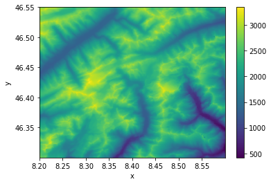
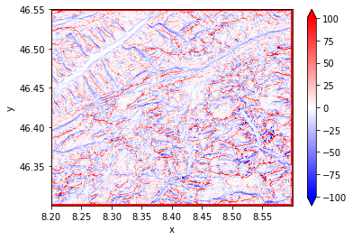

# topo-descriptors

A python library to compute DEM-based topographical descriptors.

 ## Usage

Let's install `topo-descriptors` with few additional packages that will help us
to run a simple example:

```
pip install topo-descriptors
pip install elevation
pip install rasterio
```

[elevation](https://github.com/bopen/elevation) is an python library that provides
an easy access to global elevation data. Here we are going to clip the SRTM 30m
DEM around the Basodino region in southern Switzerland, around 46.4N 8.5E:

```
eio clip -o Basodino-30m-DEM.tif --bounds 8.2 46.30 8.6 46.55
```

Now in python we can use the xarray interface to rasterio to easily import our
`Basodino-30m-DEM.tif` file:

```python
import xarray as xr

dem = xr.open_rasterio("Basodino-30m-DEM.tif")
dem = dem.isel(band=0, drop=True)
dem.plot()
```



With the DEM data imported as a xarray DataArray, we can use topo-descriptors to
compute common topographical descriptors, as here for the TPI at 500 meters scale:

```python
from topo_descriptors import topo, helpers

scale_meters = 500
scale_pixel, __ = helpers.scale_to_pixel(scale_meters, dem)
topo.tpi(dem, scale_pixel).plot(vmin=-100, vmax=100, cmap="bwr")
```

