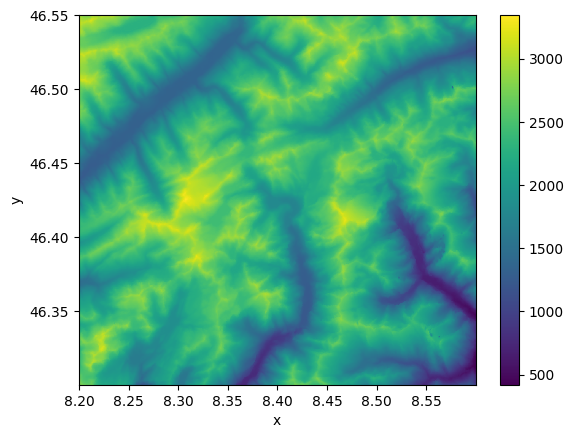

# topo-descriptors

A python library to compute DEM-based topographical descriptors.

## Usage

Let's install `topo-descriptors` with few additional packages that will help us
to run a simple example:


```python
%pip install topo-descriptors elevation rasterio matplotlib --quiet
```

    Note: you may need to restart the kernel to use updated packages.


[elevation](https://github.com/bopen/elevation) is an python library that provides
an easy access to global elevation data. Here we are going to clip the SRTM 30m
DEM around the Basodino region in southern Switzerland, around 46.4N 8.5E:


```python
!eio clip -o Basodino-30m-DEM.tif --bounds 8.2 46.30 8.6 46.55
```

    make: Nothing to be done for `download'.
    make: Nothing to be done for `all'.
    cp SRTM1.vrt SRTM1.10326a80b61e46238ff1e42d9ce37888.vrt
    gdal_translate -q -co TILED=YES -co COMPRESS=DEFLATE -co ZLEVEL=9 -co PREDICTOR=2 -projwin 8.2 46.55 8.6 46.3 SRTM1.10326a80b61e46238ff1e42d9ce37888.vrt /Users/daniele/src/topo-descriptors/Basodino-30m-DEM.tif
    rm -f SRTM1.10326a80b61e46238ff1e42d9ce37888.vrt


Now in python we can use the xarray interface to rasterio to easily import our
`Basodino-30m-DEM.tif` file:


```python
import xarray as xr

dem = xr.open_rasterio("Basodino-30m-DEM.tif")
dem = dem.isel(band=0, drop=True)
dem.plot()
```

    /var/folders/v1/d7jjg8d52fl77y27qbv75bw80000gp/T/ipykernel_89124/3852191236.py:3: DeprecationWarning: open_rasterio is Deprecated in favor of rioxarray. For information about transitioning, see: https://corteva.github.io/rioxarray/stable/getting_started/getting_started.html
      dem = xr.open_rasterio("Basodino-30m-DEM.tif")


    <matplotlib.collections.QuadMesh at 0x15ee641c0>


    

    


With the DEM data imported as a xarray DataArray, we can use topo-descriptors to
compute two established topographical descriptors: the topographical position index
(TPI) and the Sx. The TPI describes the elevation of a given point relatively
to its neighbourhood, here defined on a 500 meter scale:


```python
from topo_descriptors import topo, helpers

scale_meters = 500
scale_pixel, __ = helpers.scale_to_pixel(scale_meters, dem)
topo.tpi(dem, scale_pixel).plot(vmin=-100, vmax=100, cmap="bwr")
```

    Reprojecting coordinates from WGS84 to UTM to obtain units of meters


    <matplotlib.collections.QuadMesh at 0x28e2ca0e0>


    

    


The Sx is used to describe the horizon in a given direction and spatial scale.
In the example below we compute the Sx for a 0° azimuth (i.e., looking North)
and a radius of 500 meters.


```python
sx_500m = topo.sx(dem, azimuth=0, radius=500)
xr.DataArray(sx_500m, coords=dem.coords).plot.imshow()
```

    Reprojecting coordinates from WGS84 to UTM to obtain units of meters
    OMP: Info #276: omp_set_nested routine deprecated, please use omp_set_max_active_levels instead.


    <matplotlib.image.AxesImage at 0x2b0c6fdf0>


    

    


Other topographical descriptors are available, such as slope, aspect, derivatives,
and more.

## Build the README

To use this Jupyter Notebook to compile its markdown's version for GitHub, install the
conda environment using the `environment.yaml` file:

```shell
conda env create -f environment.yaml
conda activate topo
```

Then generate `README.md` by running:

```shell
jupyter nbconvert --execute --to markdown README.ipynb
```

The associated figures are saved in the `README_files` folder.
