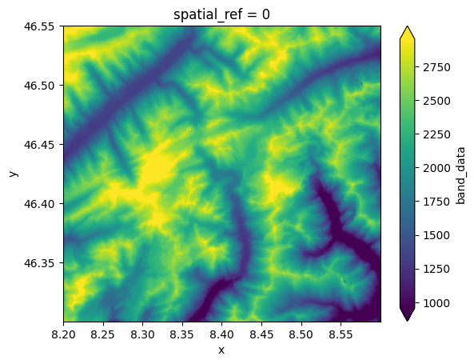
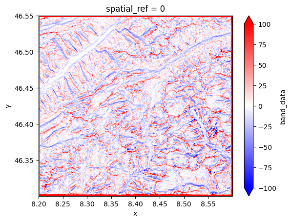
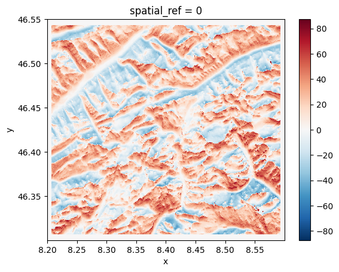
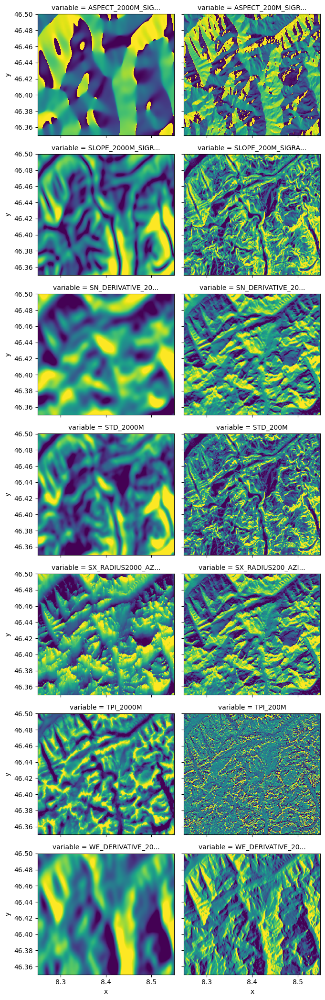

# topo-descriptors

A python library to compute DEM-based topographical descriptors.

## Usage

Let's install `topo-descriptors` with few additional packages that will help us
to run a simple example (remember to use a virtual environment):


```python
%pip install topo-descriptors elevation rioxarray matplotlib --quiet
```

    Note: you may need to restart the kernel to use updated packages.


The [elevation](https://github.com/bopen/elevation) package is an python library that
provides an easy access to global elevation data. Here we are going to clip the SRTM 30m
DEM around the Basodino region in southern Switzerland, around 46.4N 8.5E:


```python
!eio clip -o Basodino-30m-DEM.tif --bounds 8.2 46.30 8.6 46.55
```

    make: Nothing to be done for `download'.
    make: Nothing to be done for `all'.
    cp SRTM1.vrt SRTM1.0e5622d0845a4ad9a0f3e44ad90db19d.vrt
    gdal_translate -q -co TILED=YES -co COMPRESS=DEFLATE -co ZLEVEL=9 -co PREDICTOR=2 -projwin 8.2 46.55 8.6 46.3 SRTM1.0e5622d0845a4ad9a0f3e44ad90db19d.vrt /Users/daniele/src/topo-descriptors/Basodino-30m-DEM.tif
    rm -f SRTM1.0e5622d0845a4ad9a0f3e44ad90db19d.vrt


```python
import logging

logger = logging.getLogger()
handler = logging.StreamHandler()
formatter = logging.Formatter("%(asctime)s %(name)-12s %(levelname)-8s %(message)s")
handler.setFormatter(formatter)
logger.addHandler(handler)
logger.setLevel(logging.INFO)
```

Now in python we can use the xarray interface to rasterio to easily import the
`Basodino-30m-DEM.tif` file generated above:


```python
import xarray as xr

dem = xr.open_rasterio("Basodino-30m-DEM.tif")
dem = dem.isel(band=0, drop=True)
dem.plot(robust=True)
```

    /var/folders/v1/d7jjg8d52fl77y27qbv75bw80000gp/T/ipykernel_9632/102662558.py:3: DeprecationWarning: open_rasterio is Deprecated in favor of rioxarray. For information about transitioning, see: https://corteva.github.io/rioxarray/stable/getting_started/getting_started.html
      dem = xr.open_rasterio("Basodino-30m-DEM.tif")


    <matplotlib.collections.QuadMesh at 0x14776c280>


    

    


```python
from topo_descriptors import topo, helpers

scale_meters = 500
scale_pixel, __ = helpers.scale_to_pixel(scale_meters, dem)
topo.tpi(dem, scale_pixel).plot(vmin=-100, vmax=100, cmap="bwr")
```

    2023-01-09 19:11:08,498 yaconfigobject INFO     Loading /Users/daniele/src/topo-descriptors/topo_descriptors/config/topo_descriptors.conf.
    2023-01-09 19:11:08,498 yaconfigobject INFO     Loading configuration file: /Users/daniele/src/topo-descriptors/topo_descriptors/config/topo_descriptors.conf
    2023-01-09 19:11:09,032 topo_descriptors.helpers INFO     Computed in 0:00:00 (HH:mm:ss)


    <matplotlib.collections.QuadMesh at 0x28eb63280>


    

    


The Sx is used to describe the horizon in a given direction and spatial scale.
In the example below we compute the Sx for a 0° azimuth (i.e., looking North)
and a radius of 500 meters.


```python
sx_500m = topo.sx(dem, azimuth=0, radius=500)
xr.DataArray(sx_500m, coords=dem.coords).plot.imshow()
```

    OMP: Info #276: omp_set_nested routine deprecated, please use omp_set_max_active_levels instead.
    2023-01-09 19:11:13,162 topo_descriptors.helpers INFO     Computed in 0:00:03 (HH:mm:ss)


    <matplotlib.image.AxesImage at 0x2a76fb550>


    

    


Other topographical descriptors are available, such as slope, aspect, derivatives,
and more. As an example, below we show how to compute a range of descriptors for two
distinc spatial scales (200 and 2000 meters).


```python
from pathlib import Path

output_dir = Path("out/")
output_dir.mkdir(exist_ok=True)

scales_meters = [200, 2000]
domain = {"x": slice(8.25, 8.55), "y": slice(46.50, 46.35)}

topo.compute_gradient(dem, scales_meters, sig_ratios=1, crop=domain, outdir=output_dir)
topo.compute_std(dem, scales_meters, crop=domain, outdir=output_dir)
topo.compute_tpi(dem, scales_meters, crop=domain, outdir=output_dir)
topo.compute_sx(dem, azimuth=0, radius=scales_meters[0], crop=domain, outdir=output_dir)
topo.compute_sx(dem, azimuth=0, radius=scales_meters[1], crop=domain, outdir=output_dir)
```

    2023-01-09 19:11:13,301 topo_descriptors.topo INFO     ***Starting gradients computation for scales [200, 2000] meters***
    2023-01-09 19:11:13,432 topo_descriptors.topo INFO     Computing scale 200 meters with sigma ratio 1 ...
    2023-01-09 19:11:13,476 topo_descriptors.helpers INFO     Computed in 0:00:00 (HH:mm:ss)
    2023-01-09 19:11:13,487 topo_descriptors.helpers INFO     saved: out/topo_WE_DERIVATIVE_200M_SIGRATIO1.nc
    2023-01-09 19:11:13,491 topo_descriptors.helpers INFO     saved: out/topo_SN_DERIVATIVE_200M_SIGRATIO1.nc
    2023-01-09 19:11:13,495 topo_descriptors.helpers INFO     saved: out/topo_SLOPE_200M_SIGRATIO1.nc
    2023-01-09 19:11:13,499 topo_descriptors.helpers INFO     saved: out/topo_ASPECT_200M_SIGRATIO1.nc
    2023-01-09 19:11:13,499 topo_descriptors.topo INFO     Computing scale 2000 meters with sigma ratio 1 ...
    2023-01-09 19:11:13,657 topo_descriptors.helpers INFO     Computed in 0:00:00 (HH:mm:ss)
    2023-01-09 19:11:13,662 topo_descriptors.helpers INFO     saved: out/topo_WE_DERIVATIVE_2000M_SIGRATIO1.nc
    2023-01-09 19:11:13,665 topo_descriptors.helpers INFO     saved: out/topo_SN_DERIVATIVE_2000M_SIGRATIO1.nc
    2023-01-09 19:11:13,669 topo_descriptors.helpers INFO     saved: out/topo_SLOPE_2000M_SIGRATIO1.nc
    2023-01-09 19:11:13,673 topo_descriptors.helpers INFO     saved: out/topo_ASPECT_2000M_SIGRATIO1.nc
    2023-01-09 19:11:13,675 topo_descriptors.topo INFO     ***Starting STD computation for scales [200, 2000] meters***
    2023-01-09 19:11:13,808 topo_descriptors.topo INFO     Computing scale 200 meters with smoothing factor None ...
    2023-01-09 19:11:13,860 topo_descriptors.helpers INFO     Computed in 0:00:00 (HH:mm:ss)
    2023-01-09 19:11:13,865 topo_descriptors.helpers INFO     saved: out/topo_STD_200M.nc
    2023-01-09 19:11:13,865 topo_descriptors.topo INFO     Computing scale 2000 meters with smoothing factor None ...
    2023-01-09 19:11:13,923 topo_descriptors.helpers INFO     Computed in 0:00:00 (HH:mm:ss)
    2023-01-09 19:11:13,928 topo_descriptors.helpers INFO     saved: out/topo_STD_2000M.nc
    2023-01-09 19:11:13,929 topo_descriptors.topo INFO     ***Starting TPI computation for scales [200, 2000] meters***
    2023-01-09 19:11:14,061 topo_descriptors.topo INFO     Computing scale 200 meters with smoothing factor None ...
    2023-01-09 19:11:14,086 topo_descriptors.helpers INFO     Computed in 0:00:00 (HH:mm:ss)
    2023-01-09 19:11:14,090 topo_descriptors.helpers INFO     saved: out/topo_TPI_200M.nc
    2023-01-09 19:11:14,090 topo_descriptors.topo INFO     Computing scale 2000 meters with smoothing factor None ...
    2023-01-09 19:11:14,116 topo_descriptors.helpers INFO     Computed in 0:00:00 (HH:mm:ss)
    2023-01-09 19:11:14,120 topo_descriptors.helpers INFO     saved: out/topo_TPI_2000M.nc
    2023-01-09 19:11:14,121 topo_descriptors.topo INFO     ***Starting Sx computation for azimuth 0 meters and radius 200***
    2023-01-09 19:11:16,259 topo_descriptors.helpers INFO     Computed in 0:00:02 (HH:mm:ss)
    2023-01-09 19:11:16,263 topo_descriptors.helpers INFO     saved: out/topo_SX_RADIUS200_AZIMUTH0.nc
    2023-01-09 19:11:16,263 topo_descriptors.topo INFO     ***Starting Sx computation for azimuth 0 meters and radius 2000***
    2023-01-09 19:11:18,183 topo_descriptors.helpers INFO     Computed in 0:00:01 (HH:mm:ss)
    2023-01-09 19:11:18,187 topo_descriptors.helpers INFO     saved: out/topo_SX_RADIUS2000_AZIMUTH0.nc


Above, the output was written directly to disk, while in the cell below we show how 
to easly import the results and visualize them using xarray.


```python
ds = xr.open_mfdataset(str(output_dir / "topo_*.nc"))
min_max = ds.quantile(q=[0.05, 0.95])
ds = (ds - min_max.isel(quantile=0)) / (
    min_max.isel(quantile=1) - min_max.isel(quantile=0)
)
ds.to_array().plot.imshow(
    col="variable",
    col_wrap=len(scales_meters),
    robust=True,
    add_colorbar=False,
    vmin=0,
    vmax=1,
)
ds.close()
```


    

    


## Build the README

To use this Jupyter Notebook to compile the markdown's version for GitHub, first install
the conda environment using the `environment.yaml` file:

```shell
conda env create -f environment.yaml
conda activate topo
```

Then generate the `README.md` by running:

```shell
jupyter nbconvert --execute --to markdown README.ipynb
```

The associated figures are saved in the `README_files/` folder.
